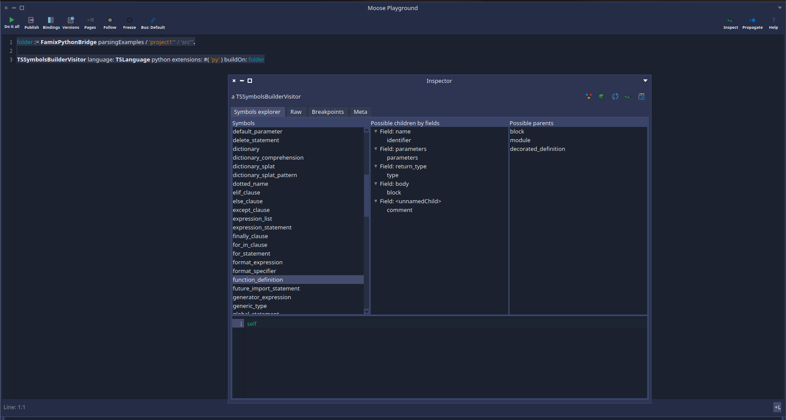

# User documentation of Tree Sitter Famix Integration

This project aim to ease the development of Famix importers based on Tree Sitter.

In the different sections of this project we will present the different utilities you can use to build a Famix importer on top of Tree Sitter.

<!-- TOC -->

- [User documentation of Tree Sitter Famix Integration](#user-documentation-of-tree-sitter-famix-integration)
	- [FamixTSNodeWrapper and FamixTSRootNodeWrapper](#famixtsnodewrapper-and-famixtsrootnodewrapper)
		- [Nodes description](#nodes-description)
		- [Does not understand management](#does-not-understand-management)
	- [Inspector extensions](#inspector-extensions)
	- [Base importer structure](#base-importer-structure)
	- [Base visitor structure](#base-visitor-structure)
		- [Specialization of the visit](#specialization-of-the-visit)
		- [Visit of single/multiple nodes](#visit-of-singlemultiple-nodes)
		- [Source anchor creation utility](#source-anchor-creation-utility)
		- [Other utilities](#other-utilities)
	- [Comment importer helper](#comment-importer-helper)
		- [Description](#description)
		- [Use it in your project](#use-it-in-your-project)
	- [Error repport](#error-repport)
	- [Inspect the symbols of your project: TSSymbolsBuilderVisitor](#inspect-the-symbols-of-your-project-tssymbolsbuildervisitor)
	- [Find a node matching a pattern with the FamixTSDebugVisitor](#find-a-node-matching-a-pattern-with-the-famixtsdebugvisitor)
	- [Symbol resolution](#symbol-resolution)
	- [Context Stack building](#context-stack-building)
	- [Example of parsers written with those tools](#example-of-parsers-written-with-those-tools)

<!-- TOC -->

## FamixTSNodeWrapper and FamixTSRootNodeWrapper

### Nodes description 

The current implementation of Pharo-Tree-Sitter is using FFI to get all info from the tree. Each time you ask child nodes or parent nodes, you get a new instance. So if you have a TSNode and do: `aTSNode collectNamedChild anyOne parent`, instead of this returnin the same entity than the receiver, you will get a new instance. 

This can make it more complexe to implement some logic, expecially everything linked to the source code management since TreeSitter nodes do not know their source.

This might be improved in the future by improving the FFI binding of TreeSitter, but in the meantime, we are proposing a wrapper for `TSNodes`.

The root node of the tree can be wrapped in a `FamixTSRootNodeWrapper`. This wrapper can have a visitor set to offer some utilities.

If you use the `FamixTSAbstractVisitor` and the `FamixTSAbstractImporter`, it will be set automatically without you having to do anything (This happens in `FamixTSRootNode>>#accept:`).

Knowing the visitor allows to enrich the API of the nodes with methods such as:
- `completeSource` : This is the source of the file that produced this parsed tree
- `relativePath` : This is the relative path of the file been parsed from the root `FileReference` provided by the parse
- `sourceText` : the source of the current node
- `startPosition` : the start position of the node in the file
- `endPosition` : the end position of the node in the file

They will be especially helpful to produce the file references of model to produce. But we will explore this in a future section about the `FamixTSAbstractVisitor`.

`FamixTSRootNodeWrapper` will produce instances of `FamixTSNodeWrapper` once we ask its children. Both those classes reimplement the methods to get the parents or children nodes in order to save the instances and not recreate new instances each time we request them. This allows to access the sources without losing this info.

Those nodes also comes with some helper methods that can be useful during the development of a parser such as:
- `#includesChild:` Returns true if I contain the parameter in my children recursively. For example: `aNode includesChild: anIdentifierNode`
- `#isInField:ofParentOfType:` Returns true if the node is in the field named like the first parameter of a node of the kind of the second parameter. For example: `aNode isInField: #body ofParentOfType: #list_comprehension`.
- `#parentsDo:` Iterate over each parents recursively and execute the block as parameter

### Does not understand management

The nodes are wrapping a `TSNode`. Some of the API is reimplemented, but in case it is not the case, then `#doesNotUnderstand:` will forward the message to the wrapped node.

Another utility got added to the `#doesNotUnderstand:`: the easy access to nodes fields.
In the API of `TSNode`, the nodes can have `fields` that are an association between a name and associated nodes (or even a single node).

The API to access such a field is `#nodeChildByFieldName:`. But you also need to check if the field exists. Or you can use `#collectFieldNameOfNamedChild`. For example:

```st
    aTSNode collectFieldNameOfNamedChild at: #name ifPresent: [ :node | famixEntity name: node sourceText ].

    "If it cannot be nil:"
    famixEntity name: (aTSNode nodeChildByFieldName: 'name')
```

 Since this is something we are often doing in the creation of a parser, with a wrapped node it is possible to acces a field using the name of the field prefixed by `_`. If the field does not exist, it returns nil. The previous code becomes:

 ```st
    aTSNode _name ifNotNil: [ :node | famixEntity name: node sourceText ].

    "If it cannot be nil:"
    famixEntity name: aTSNode _name sourceText
 ```

> This might evolve in the future. Currently this is always going through the `#doesNotUnderstand:`, but in the future it is possible that the code will be generated to avoid the warnings from Pharo. Nothing is sure yet.

## Inspector extensions

Another useful feature of this project is to add multiple inspector tabs.

The wrapped node have multiple.

An inspector to see the expanded tree of a node:


An inspector to see the fields of a node:


An inspector to see the source code of a node:


An inspector to see the source code of a node inside the complete source of the file that produced the node:


Future inspectors might come. For example I would like an inspector tab to be able to see all the possible symbols of a project, and if possible, the possible parent/children symbols. (But days are only 24h long :'( )

## Base importer structure

The project is providing the base to build an importer with the class `FamixTSAbstractImporter`.

You can start your infrastructure by subclassing it. For example, in a python importer:

```st
FamixTSAbstractImporter << #FamixPythonImporter
	slots: { #rootPackagePath . #filesToIgnoreBlock }; "Those two variables are specific to the python importer"
	tag: 'Importer';
	package: 'Famix-Python-Importer'
```

Then you will need to define the TreeSitter language to use in this importer by overriding `FamixTSAbstractImporter>>#treeSitterLanguage`.

```st
FamixPythonImporter >> treeSitterLanguage

	^ TSLanguage python
```

Then you need to define the visitor class to use (See section [Base visitor structure](#base-visitor-structure)). You can do it by overriding `FamixTSAbstractImporter>>#visitorClass`:

```st
FamixPythonImporter >> visitorClass

	^ FamixPythonVisitor
```

This importer comes with a method `#import:` taking a file reference as parameter (the file reference is a file to parse or the folder of a project), and doing multiple things:
- It initializes the visitor
- It creates a new model
- It launch the visit and parsing of the files
- It launches the symbol resolution of the symbols registered by the SymbolResolver (See section [Symbol resolution](#symbol-resolution))
- It deals with the errors detected during the parsing (we will explain more in this later in this section)
- And it finaly returns the created Famix model

The second step will take care of some things such as setting the root folder or source language of the model.

The third step is done via `FamixTSAbstractImporter>>#importFileReference:` but this method is abstract and needs to be reimplemented because it will be specific to each langage. For example in python we can have normal folders, folders representing a package, files representing a package and files representing a module, file that is not a python file...
So we need to manage ourself the visit of the folders and files. When we have a file that we need to parse, we can then call `FamixTSAbstractImporter>>#importFile:` that will manage the parsing and visit of the file.

For example in python:

```st
FamixPythonImporter >> importFileReference: aFileReference
	"We can have multiple cases here. 
	
	The file reference can be a directory or a file. 
	
	If it is a directory, we check if it contains .py files to know if it is a folder or a package. If it is a package, we create the entity and visit its content.
	If it is a file, we parse it if it is a python file.
	"

	aFileReference isDirectory ifTrue: [
			(aFileReference allFiles anySatisfy: [ :file | file isPythonFile ]) ifTrue: [
					| package |
					package := visitor model newPackageNamed: aFileReference basename.
					visitor withCurrentEntityDo: [ :entity | package parentPackage: entity ].
					visitor
						useCurrentEntity: package
						during: [ "If we have an __init__.py file, this is a package. To have it at the top of the context we need to parse it first so that the sub packages and modules go in it."
								(aFileReference children sorted: [ :fileA :fileB | fileA isPythonPackageDeclaration or: [ fileB isPythonPackageDeclaration not ] ]) ifNotEmpty: [ :files |
									files do: [ :child | self importFileReference: child ] ] ] ].

			^ self ].

	aFileReference isPythonFile ifFalse: [ ^ self ].

	self importFile: aFileReference
```

Now your importer is ready to be used (once the visitor will be working ;) ). But there is a last thing you can configure!

The project comes with a system of error catching to not fail in the visitor or the symbol resolver has a problem (See [Error repport](#error-repport)). In the end of the import, you need to decide what to do with this error report. 
By default we inspect it to ease the development. But in production you might want to do something else. In that case you need to override `FamixTSAbstractImporter>>#manageErrorReport` whose default implementation is:

```st
manageErrorReport

	^ self errorReport ifNotEmpty: [ self errorReport inspect ]
```
 
## Base visitor structure

On top of a basic structure for the importer, we also provide a basic visitor infrastructure.

In order to use it, you will need to subclass `FamixTSAbstractVisitor`. For example:

```st
FamixTSAbstractVisitor << #FamixPythonVisitor
	slots: { #importPaths }; "Variable specific to python"
	tag: 'Visitors';
	package: 'Famix-Python-Importer'
```

Then you need to use this class in your importer by overriding `FamixTSAbstractImporter>>#visitorClass`.

Then you will need to visit your nodes in order to build your Famix model. The visitor comes with a few utilities to help you with that. 

### Specialization of the visit

In Tree Sitter we have only one kind of nodes, `TSNode`. This does not help to build a nice visitor. So, this project provides help with this!

The method `#visitNodes:` is overriden in `FamixTSAbstractVisitor` in order to call a visit method infered from the type of the node. 
For example, when `#visitNode:` will be called on a `TSNode` whose type is `class_definition`, then it will try to call `#visitClassDefinition:`. If the method exists, it will be executed. If it doen not exist, it will leave a log in the Transcript and it will call the super version of `#visitNodes:` that will just visit the children.

So we can implement methods like:

```st
visitClassDefinition: aClassDefinitionNode

	| class name |
	name := aClassDefinitionNode _name sourceText. "No need to visit. It will always be an identifier and this identifier do not need symbol resolution."

	self checkShadowingOfName: name during: [
			class := (self isMetaclassDefinition: aClassDefinitionNode)
				         ifTrue: [ model newMetaclassNamed: name ]
				         ifFalse: [ model newClassNamed: name ] ].

	class typeContainer: self currentEntity.

	self setSourceAnchor: class from: aClassDefinitionNode.

	^ self useCurrentEntity: class during: [
			  self setSuperclassesOf: aClassDefinitionNode.
			  self setMetaclassOf: aClassDefinitionNode.
			  self visit: aClassDefinitionNode _body ]
```

Also, since we overrided `#visitNode:` in the abstract class, it is not possible anymore to do `super visitNode: aTSNode` in our visit method in order to visit the children. We provided the method `#visitChildren:` in order to still be able to do that. 

Example:

```st
visitCall: aCallNode

	self resolveInvocationOrInstantiationFrom: aCallNode.

	^ self visitChildren: aCallNode
```

### Visit of single/multiple nodes

While using the fields of a node in a visit method, it can become quite complexe because depending on what is parsed, a field can have 3 states:
- The field returns a single node
- The field returns a collection of nodes
- The field is not present

In order to avoid a lot of conditions, a visit method is provided to manage all those cases: `#visit:`. The implementation is like this:

```st
visit: anObject

	anObject isTSNode ifTrue: [ ^ self visitNode: anObject ].
	anObject isCollection ifTrue: [ ^ self visitNodes: anObject ].
	^ anObject
```

Going along with:

```st
visitNodes: aCollection

	^ aCollection collect: [ :node | self visit: node ]
```

So, if you access a field like this: `self visit: aTSNode _superclasses` you can have 3 possible cases:
- The field does not exist, `_superclasses` will return nil, and the visit will return nil
- The field returns a single node, we visit it and return the result of the visit
- The field returns a collection of noder, we visit them all and return a collection of the result of the visits

This should reduce the complexity of you code quite a lot. For example:

```st
visitFunctionDefinition: aFunctionDefinition
	"the parser does not make a difference between function and method, but a method is defined in a class and its first parameter is self."

	| entity |
	entity := self currentEntity isClass
		          ifTrue: [ self ensureMethod: aFunctionDefinition ]
		          ifFalse: [ self createFunction: aFunctionDefinition ].

	^ self useCurrentEntity: entity during: [
			  self visit: aFunctionDefinition _parameters.
			  self visit: aFunctionDefinition _body ]
```

### Source anchor creation utility

Another utility provided is a way to easily create a source anchor. For this, you will just need the Famix entity and the TSNode associated. The creation can be done using `FamixTSAbstractVisitor>>#setSourceAnchor:from:`.

Example:

```st
createWriteAccessTo: variable from: anAssignmentNode

	| access |
	access := model newAccess
		          variable: variable;
		          accessor: self currentEntity;
		          isWrite: true;
		          yourself.
	self setSourceAnchor: access from: anAssignmentNode
```

### Other utilities

Other little things can make your like easier.

For example:
- The visitor knows the file reference been parsed with `#fileReference`.
- It knows the sources that produced the `TSTree` with `#sourceText`.
- It knows also the model in which we need to create the entities with `#model`.
- It knows the relative path to the file that produced the tree from the root folder with `#relativePath`.

## Comment importer helper

My set of tools includes an utility to help with the import of comments.

### Description

In programming languages we have often two kinds of comments:
- Single line comments
- Multiline comments

I propose an utility, `FamixTSAbstractCommentsVisitor` to import both kinds and attribute those comments to the right entity.

Here is a little list of what I am doing:
- If multiple single line comments are following each others and have only line return between them, I'll merge those single line comments into one entity
- If a comment is one line before the declaration of an entity, I'll attach the comment to this entity. (Typically, we add comments before a class declaration or a method definition)
- In a single line comment is on the same line than an entity declaration, then I'll attach it to this entity. (Typically, if we comment a variable on the line of its declaration)
- If a comment is inside an entity, we attach it to this entity

Also, it is often a bother to think about visiting all the comment nodes during the writting of the visitor. (I had multiple failed tests in an importer I did because I forgot to visit some...) In order to avoid this problem, this utility do its own visit of the tree to manage only comments! So, no need to care about comments in your main visitor. You can just skip them and do nothing when you encounter those nodes.

### Use it in your project

In order to use this utility, you will need to subclass `FamixTSAbstractCommentsVisitor`. For example, in my python parser I did:

```st
FamixTSAbstractCommentsVisitor << #FamixPythonCommentVisitor
	slots: {};
	tag: 'Importer';
	package: 'Famix-Python-Importer'
```

Now we will need to override `#visitNode:` in order to find the nodes representing comments.
In order to declare those comments you can use two methods:
- `FamixTSAbstractCommentsVisitor>>#addMultilineCommentNode:` This one takes a TSNode and registers a multiline comment for it
- `FamixTSAbstractCommentsVisitor>>#addSingleLineCommentNode:` This one takes a TSNode and registers a single line comment for it

For example in my python parser I did:

```st
FamixPythonCommentVisitor >> visitNode: aTSNode

  "comment nodes are single line comments"
	aTSNode type = #comment ifTrue: [ self addSingleLineCommentNode: aTSNode ].

  "String in an expression statement are a way to do multiline comments in python"
	(aTSNode type = #string and: [ aTSNode parent type = #expression_statement ]) ifTrue: [ self addMultilineCommentNode: aTSNode ].

	super visitNode: aTSNode
```

Now you will need to launch the visit and the import.
In order to do this you will need to provide the wrapped root node to visit and your instance of `FamixTSAbstractVisitor`. This instance will be used to look for the entities to attach the comments to and to create the comments instances.

For example:

```st
FamixPythonCommentVisitor visitor: self importCommentsOf: aModuleNode.
```

Now, the place where to put this code can depend on your parser. It needs to be done after visiting the model to create all entities. In order to find the entities that can have comment, we are using `visitor currentEntity withAllChildren`. This means that when you launch the import of comments, your current entity needs to the be one with all the children of the file that is been imported. In case you have a more tricky situation with your language, you can override `FamixTSAbstractCommentsVisitor>>#computeEntitiesInCurrentFile` in order to give another set of entities.

In my python parser I decided to add the import if the first visit method we will always find: `#visitModule:`. And I call it after setting the module as a current entity.

```st
visitModule: aModuleNode

  | entity |
  "some code..."
  entity := model newModuleNamed: self fileReference basenameWithoutExtension.

  self setSourceAnchor: entity from: aModuleNode.

  ^ self useCurrentEntity: entity during: [ 
      self visitChildren: aModuleNode.

      "Importing the comments of the file."
      FamixPythonCommentVisitor visitor: self importCommentsOf: aModuleNode ]
```


## Error repport

In the development of a parser it is common to have edge cases that are hard to handle and to have crashes. This project provides a little utility to help handling such cases. This utility comes from the `SymbolResolver` project that we will explore more in the section [Symbol resolution](#symbol-resolution). If everything is fine, you should not have to mange this error report yourself because `TreeSitterFamixIntegration` is managing it for you directly. But here is a little explanation of what happens under the hood.

`SRParsingReport` is instanciated by the `SRSymbolsSolver` in the `errorReport` instance variable during its initialization. It can be used to add a safeguard during the execution of some code to catch errors or warnings without interruptiong the parsing. The `FamixTSAbstractVisitor` instantiate directly this solver and propose the error repport itself.

It can be used during the visit of an AST with a visitor using `SRTSolverUserVisitor` like this:

```st
acceptNode: aNode

	^ self errorReport catch: Error during: [ super acceptNode: aNode ]
```

Or in the case of this project:

```st
FamixTSAbstractVisitor>>#visitNode: aTSNode
	"Here we are performing a special visit method. If it is not implemented the #doesNotUnderstood: will call my super visitNode:. The reason we are doing this is to simplify the debugging of a visitor to not have to step over a lot of method calls..."

	^ self errorReport catch: Exception during: [ self perform: (self buildVisitMethodNameFor: aTSNode) with: aTSNode ]

```

This error report is also used during the symbol resolution directly in the method `SRSymbolsSolver>>#resolveUnresolvedSymbols`.

By default, at the end of the parsing, if error happened, they will be inspected. But it is possible to change the behavior by overriding the method `FamixTSAbstractImporter>>#manageErrorReport` in your own importer.

> [!TIP]
> While developping a parser it might be interesting to have an actual debugger instead of catching all the errors. It is possible to go in development mode via the world menu: `Debug > Toggle Symbol Resolver Debug mode`

## Inspect the symbols of your project: TSSymbolsBuilderVisitor

This section will describe TSSymbolsBuilderVisitor that is now part of the Pharo-Tree-Sitter project directly.

It is a little visitor used to see all the symbols present in a project and explore their children (grouped by their fields) and parents.

You can use it like this: 

```st
	folder := FamixPythonBridge parsingExamples / 'project1'.
	TSSymbolsBuilderVisitor language: TSLanguage python extensions: #( 'py' ) buildOn: folder
```

And you will get a result like this: 



> Note: Be careful, you are not guarantee to have all possible child and parents since it will produce the mapping from what it encounters in the files you will provide. To be more accurate, give it the maximum number of sources possible.

## Find a node matching a pattern with the FamixTSDebugVisitor

In some cases we know that a type of node can be in another type for example, but we don't really know in which case it happens. 
In that case the `FamixTSDebugVisitor` can be used. 

You can configure it with a language, a stop block and a folder to parse and it will stop on the first node matching the stop block.

Here is a example: in Python I want to find an attribute that has a concatenized string inside:

```st
folder := FamixPythonBridge parsingExamples / 'project1'.

FamixTSDebugVisitor language: TSLanguage python extensions: #( 'py' ) stopIf: [ :aNode | aNode type = #concatenated_string and: [ aNode parent type = #attribute ] ]  visit: folder
```

Or with some suggar:

```st
folder := FamixPythonBridge parsingExamples / 'project1'.

FamixTSDebugVisitor pythonStopIf: [ :aNode | aNode type = #concatenated_string and: [ aNode parent type = #attribute ] ]  visit: folder
```

Then it will stop on the first node matching the block.


## Symbol resolution

This project also comes with helps for symbol resolution and the creation of the context stack.

[But a documentation already exist.](https://github.com/jecisc/SymbolResolver/blob/main/resources/docs/UserDocumentation.md)

## Context Stack building

We we are writting an importer, we need to build a stack of contexts. This can be simplified with this project.

[Same as the previous section, the documentation can be found in SymbolResolver documentation.](https://github.com/jecisc/SymbolResolver/blob/main/resources/docs/UserDocumentation.md)

## Example of parsers written with those tools

Here are some parsers written with those tools:
- [https://github.com/moosetechnology/MoosePy](https://github.com/moosetechnology/MoosePy)
- [https://github.com/moosetechnology/Famix-C-Importer](https://github.com/moosetechnology/Famix-C-Importer)