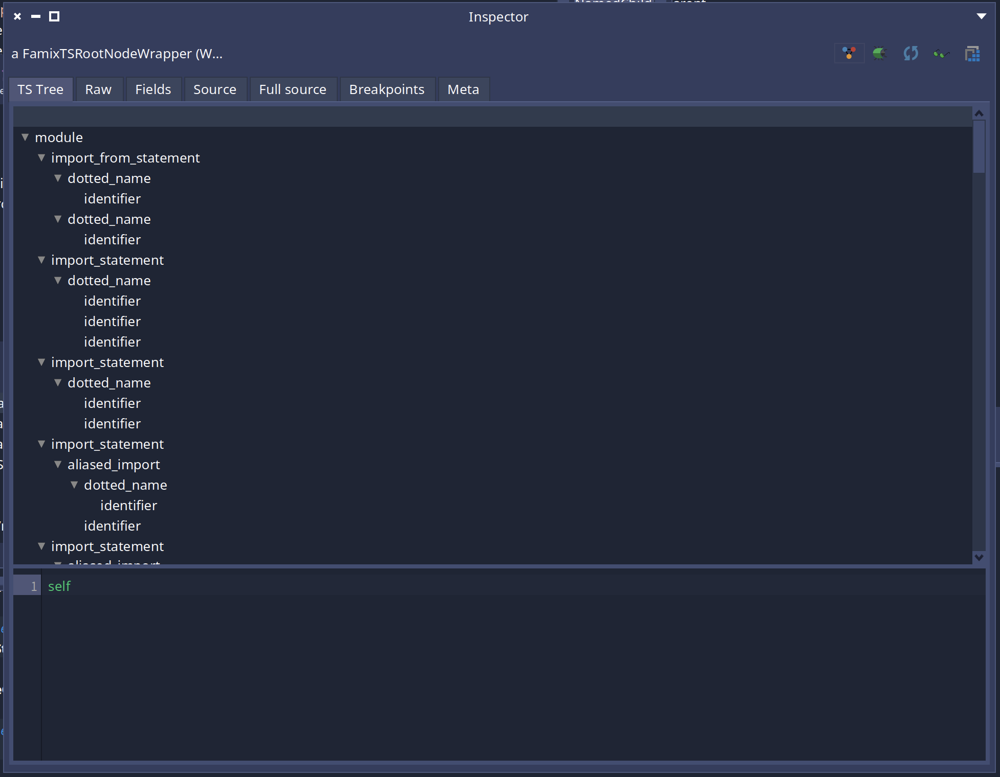
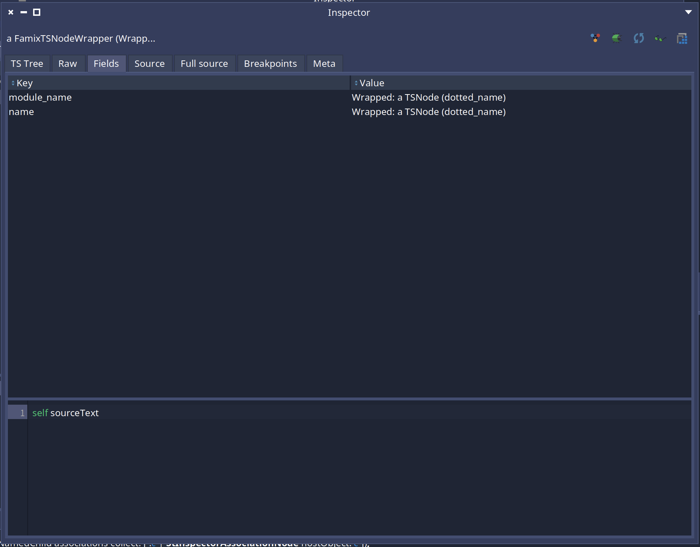
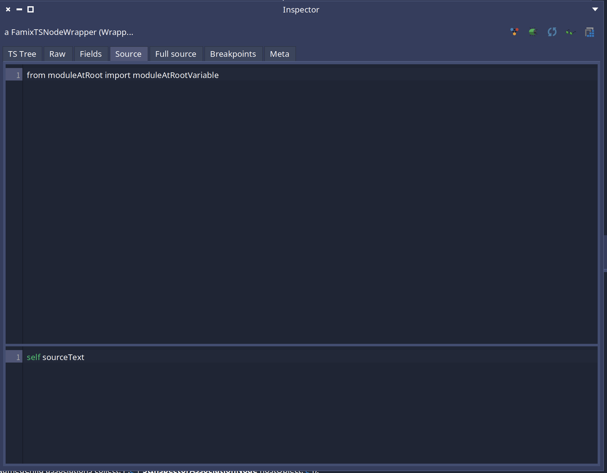
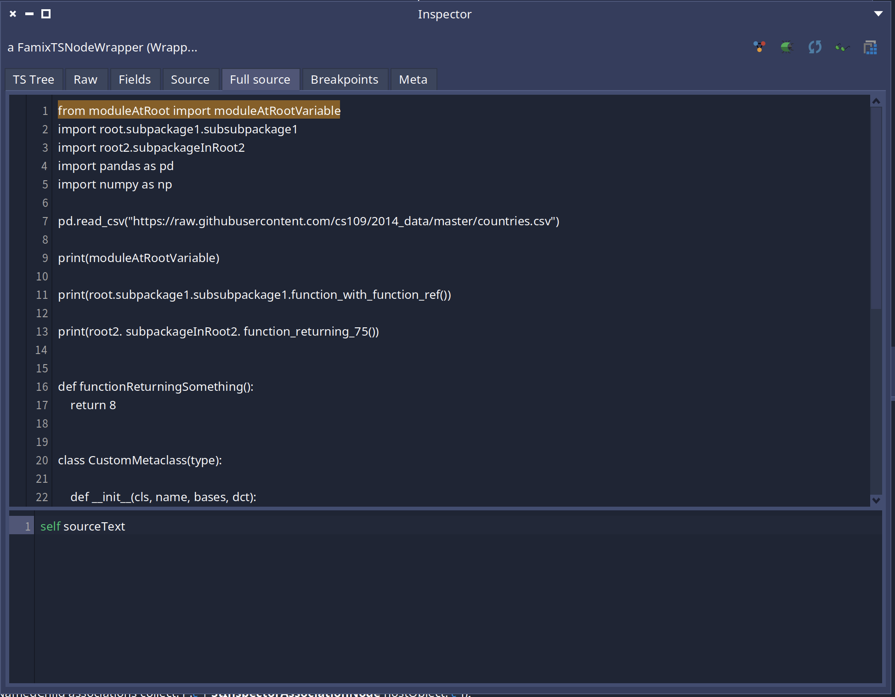

# User documentation of Tree Sitter Famix Integration

This project aim to ease the development of Famix importers based on Tree Sitter.

In the different sections of this project we will present the different utilities you can use to build a Famix importer on top of Tree Sitter.

<!-- TOC -->

- [User documentation of Tree Sitter Famix Integration](#user-documentation-of-tree-sitter-famix-integration)
  - [FamixTSNodeWrapper and FamixTSRootNodeWrapper](#famixtsnodewrapper-and-famixtsrootnodewrapper)
    - [Nodes description](#nodes-description)
    - [Does not understand management](#does-not-understand-management)
  - [Inspector extensions](#inspector-extensions)
  - [FamixTSAbstractImporter](#famixtsabstractimporter)
  - [FamixTSAbstractVisitor](#famixtsabstractvisitor)
    - [Specialization of the visit](#specialization-of-the-visit)
    - [Visit of single/multiple fields](#visit-of-singlemultiple-fields)
  - [Comment importer helper](#comment-importer-helper)
    - [Description](#description)
    - [Use it in your project](#use-it-in-your-project)
  - [Error repport](#error-repport)
  - [Symbol resolution](#symbol-resolution)
  - [Context Stack building](#context-stack-building)
  - [Example of parsers written with those tools](#example-of-parsers-written-with-those-tools)

<!-- /TOC -->
<!-- /TOC -->

## FamixTSNodeWrapper and FamixTSRootNodeWrapper

### Nodes description 

The current implementation of Pharo-Tree-Sitter is using FFI to get all info from the tree. Each time you ask child nodes or parent nodes, you get a new instance. So if you have a TSNode and do: `aTSNode collectNamedChild anyOne parent`, instead of this returnin the same entity than the receiver, you will get a new instance. 

This can make it more complexe to implement some logic, expecially everything linked to the source code management since TreeSitter nodes do not know their source.

This might be improved in the future by improving the FFI binding of TreeSitter, but in the meantime, we are proposing a wrapper for `TSNodes`.

The root node of the tree can be wrapped in a `FamixTSRootNodeWrapper`. This wrapper can have a visitor set to offer some utilities.

If you use the `FamixTSAbstractVisitor` and the `FamixTSAbstractImporter`, it will be set automatically without you having to do anything (This happens in `FamixTSRootNode>>#accept:`).

Knowing the visitor allows to enrich the API of the nodes with methods such as:
- `completeSource` : This is the source of the file that produced this parsed tree
- `relativePath` : This is the relative path of the file been parsed from the root `FileReference` provided by the parse
- `sourceText` : the source of the current node
- `startPosition` : the start position of the node in the file
- `endPosition` : the end position of the node in the file

They will be especially helpful to produce the file references of model to produce. But we will explore this in a future section about the `FamixTSAbstractVisitor`.

`FamixTSRootNodeWrapper` will produce instances of `FamixTSNodeWrapper` once we ask its children. Both those classes reimplement the methods to get the parents or children nodes in order to save the instances and not recreate new instances each time we request them. This allows to access the sources without losing this info.

### Does not understand management

The nodes are wrapping a `TSNode`. Some of the API is reimplemented, but in case it is not the case, then `#doesNotUnderstand:` will forward the message to the wrapped node.

Another utility got added to the `#doesNotUnderstand:`: the easy access to nodes fields.
In the API of `TSNode`, the nodes can have `fields` that are an association between a name and associated nodes (or even a single node).

The API to access such a field is `#nodeChildByFieldName:`. But you also need to check if the field exists. Or you can use `#collectFieldNameOfNamedChild`. For example:

```st
    aTSNode collectFieldNameOfNamedChild at: #name ifPresent: [ :node | famixEntity name: node sourceText ].

    "If it cannot be nil:"
    famixEntity name: (aTSNode nodeChildByFieldName: 'name')
```

 Since this is something we are often doing in the creation of a parser, with a wrapped node it is possible to acces a field using the name of the field prefixed by `_`. If the field does not exist, it returns nil. The previous code becomes:

 ```st
    aTSNode _name ifNotNil: [ :node | famixEntity name: node sourceText ].

    "If it cannot be nil:"
    famixEntity name: aTSNode _name sourceText
 ```

> This might evolve in the future. Currently this is always going through the `#doesNotUnderstand:`, but in the future it is possible that the code will be generated to avoid the warnings from Pharo. Nothing is sure yet.

## Inspector extensions

Another useful feature of this project is to add multiple inspector tabs.

The wrapped node have multiple.

An inspector to see the expanded tree of a node:



An inspector to see the fields of a node:



An inspector to see the source code of a node:



An inspector to see the source code of a node inside the complete source of the file that produced the node:



Future inspectors might come. For example I would like an inspector tab to be able to see all the possible symbols of a project, and if possible, the possible parent/children symbols. (But days are only 24h long :'( )

## FamixTSAbstractImporter

TODO
 
## FamixTSAbstractVisitor

TODO

### Specialization of the visit

TODO

### Visit of single/multiple fields

TODO

## Comment importer helper

My set of tools includes an utility to help with the import of comments.

### Description

In programming languages we have often two kinds of comments:
- Single line comments
- Multiline comments

I propose an utility, `FamixTSAbstractCommentsVisitor` to import both kinds and attribute those comments to the right entity.

Here is a little list of what I am doing:
- If multiple single line comments are following each others and have only line return between them, I'll merge those single line comments into one entity
- If a comment is one line before the declaration of an entity, I'll attach the comment to this entity. (Typically, we add comments before a class declaration or a method definition)
- In a single line comment is on the same line than an entity declaration, then I'll attach it to this entity. (Typically, if we comment a variable on the line of its declaration)
- If a comment is inside an entity, we attach it to this entity

Also, it is often a bother to think about visiting all the comment nodes during the writting of the visitor. (I had multiple failed tests in an importer I did because I forgot to visit some...) In order to avoid this problem, this utility do its own visit of the tree to manage only comments! So, no need to care about comments in your main visitor. You can just skip them and do nothing when you encounter those nodes.

### Use it in your project

In order to use this utility, you will need to subclass `FamixTSAbstractCommentsVisitor`. For example, in my python parser I did:

```st
FamixTSAbstractCommentsVisitor << #FamixPythonCommentVisitor
	slots: {};
	tag: 'Importer';
	package: 'Famix-Python-Importer'
```

Now we will need to override `#visitNode:` in order to find the nodes representing comments.
In order to declare those comments you can use two methods:
- `FamixTSAbstractCommentsVisitor>>#addMultilineCommentNode:` This one takes a TSNode and registers a multiline comment for it
- `FamixTSAbstractCommentsVisitor>>#addSingleLineCommentNode:` This one takes a TSNode and registers a single line comment for it

For example in my python parser I did:

```st
FamixPythonCommentVisitor >> visitNode: aTSNode

  "comment nodes are single line comments"
	aTSNode type = #comment ifTrue: [ self addSingleLineCommentNode: aTSNode ].

  "String in an expression statement are a way to do multiline comments in python"
	(aTSNode type = #string and: [ aTSNode parent type = #expression_statement ]) ifTrue: [ self addMultilineCommentNode: aTSNode ].

	super visitNode: aTSNode
```

Now you will need to launch the visit and the import.
In order to do this you will need to provide the wrapped root node to visit and your instance of `FamixTSAbstractVisitor`. This instance will be used to look for the entities to attach the comments to and to create the comments instances.

For example:

```st
FamixPythonCommentVisitor visitor: self importCommentsOf: aModuleNode.
```

Now, the place where to put this code can depend on your parser. In order to find the entities that can have comment, we are using `visitor currentEntity withAllChildren`. This means that when you launch the import of comments, your current entity needs to the be one with all the children of the file that is been imported. In case you have a more tricky situation with your language, you can override `FamixTSAbstractCommentsVisitor>>#computeEntitiesInCurrentFile` in order to give another set of entities.

In my python parser I decided to add the import if the first visit method we will always find: `#visitModule:`. And I call it after setting the module as a current entity.

```st
visitModule: aModuleNode

  | entity |
  "some code..."
  entity := model newModuleNamed: self fileReference basenameWithoutExtension.

  self setSourceAnchor: entity from: aModuleNode.

  ^ self useCurrentEntity: entity during: [ 
      self visitChildren: aModuleNode.

      "Importing the comments of the file."
      FamixPythonCommentVisitor visitor: self importCommentsOf: aModuleNode ]
```


## Error repport

In the development of a parser it is common to have edge cases that are hard to handle and to have crashes. This project provides a little utility to help handling such cases. This utility comes from the `SymbolResolver` project that we will explore more in the section [Symbol resolution](#symbol-resolution). If everything is fine, you should not have to mange this error report yourself because `TreeSitterFamixIntegration` is managing it for you directly. But here is a little explanation of what happens under the hood.

`SRParsingReport` is instanciated by the `SRSymbolsSolver` in the `errorReport` instance variable during its initialization. It can be used to add a safeguard during the execution of some code to catch errors or warnings without interruptiong the parsing. The `FamixTSAbstractVisitor` instantiate directly this solver and propose the error repport itself.

It can be used during the visit of an AST with a visitor using `SRTSolverUserVisitor` like this:

```st
acceptNode: aNode

	^ self errorReport catch: Error during: [ super acceptNode: aNode ]
```

Or in the case of this project:

```st
FamixTSAbstractVisitor>>#visitNode: aTSNode
	"Here we are performing a special visit method. If it is not implemented the #doesNotUnderstood: will call my super visitNode:. The reason we are doing this is to simplify the debugging of a visitor to not have to step over a lot of method calls..."

	^ self errorReport catch: Exception during: [ self perform: (self buildVisitMethodNameFor: aTSNode) with: aTSNode ]

```

This error report is also used during the symbol resolution directly in the method `SRSymbolsSolver>>#resolveUnresolvedSymbols`.

By default, at the end of the parsing, if error happened, they will be inspected. But it is possible to change the behavior by overriding the method `FamixTSAbstractImporter>>#manageErrorReport` in your own importer.

> [!TIP]
> While developping a parser it might be interesting to have an actual debugger instead of catching all the errors. It is possible to go in development mode via the world menu: `Debug > Toggle Symbol Resolver Debug mode`


## Symbol resolution

This project also comes with helps for symbol resolution and the creation of the context stack.

[But a documentation already exist.](https://github.com/jecisc/SymbolResolver/blob/main/resources/docs/UserDocumentation.md)

## Context Stack building

We we are writting an importer, we need to build a stack of contexts. This can be simplified with this project.

[Same as the previous section, the documentation can be found in SymbolResolver documentation.](https://github.com/jecisc/SymbolResolver/blob/main/resources/docs/UserDocumentation.md)

## Example of parsers written with those tools

Here are some parsers written with those tools:
- [https://github.com/moosetechnology/MoosePy](https://github.com/moosetechnology/MoosePy)
- [https://github.com/moosetechnology/Famix-C-Importer](https://github.com/moosetechnology/Famix-C-Importer)